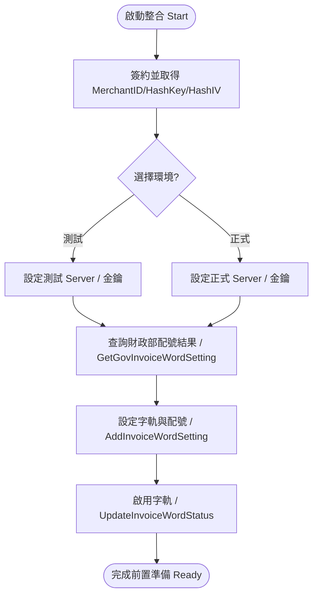
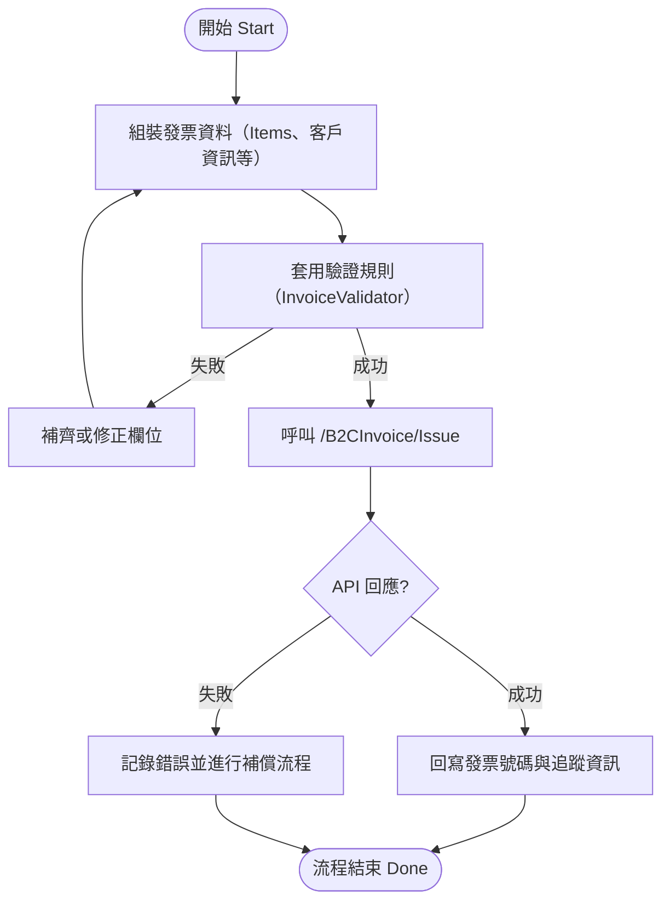
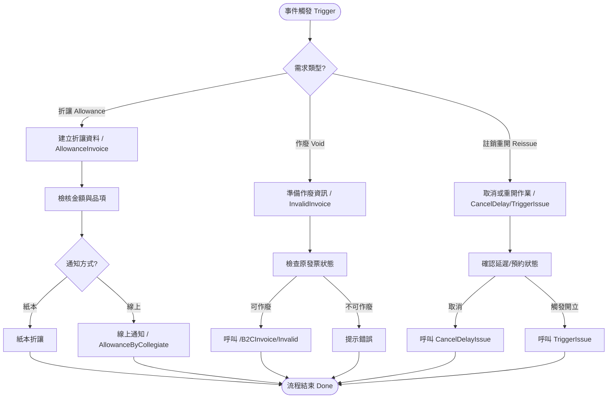

# 綠界電子發票 API 摘要

## 文件結構

- `api-overview.md`：介接流程、模組分類、請求/回應格式與常見參數。
- `error-codes.md`：常見錯誤碼與專案內部驗證例外對照。

## 官方資源
- 技術支援：<https://developers.ecpay.com.tw/?p=7809>

> 建議在專案升級或綠界公告有修訂時，檢查官方文件是否更新並同步調整本摘要。

## Laravel 整合重點

1. Service Provider：`ecPay\eInvoice\Laravel\EcPayServiceProvider` 會自動載入，或可手動加入 `config/app.php`。
2. 設定檔：執行 `php artisan vendor:publish --tag=ecpay-einvoice-config` 生成 `config/ecpay-einvoice.php`，設定 MerchantID / HashKey / HashIV。
3. Service Container：`app('ecpay.invoice')`、`app('ecpay.query_invoice')` 等 key 將回傳對應的操作物件，可由 `config/ecpay-einvoice.php` 的 `bindings` 區段調整。
4. Facade：`EcPayInvoice` 與 `EcPayQuery` 皆繼承 `OperationFactory`，可透過 `EcPayInvoice::make()`、`EcPayQuery::invoice()` 快速取得常用類別。

---

## Files
- `api-overview.md`: onboarding flow, module list, shared request/response shapes
- `error-codes.md`: frequently observed API errors and the corresponding in-code validation hints

## Official Resources
- API support: <https://developers.ecpay.com.tw/?p=7809>

> When ECPay announces updates, re-sync these notes to stay aligned with production behavior.

---

## 使用流程圖 / Flowcharts

以下流程根據官方 B2C 電子發票技術文件的「使用流程圖說明」整理，提供中英文並列的 mermaid 圖示，方便快速瀏覽整體作業節點[[1]](https://developers.ecpay.com.tw/?p=7829)。

### 前置設定 / Pre-Operation Setup

### 開立發票 / Issue Invoice

### 折讓 / 作廢 / 註銷流程  
Allowance / Void / Reissue Flow

> 若需放大細節或補充其他流程，可在此章節持續擴充新的 mermaid 圖表。
